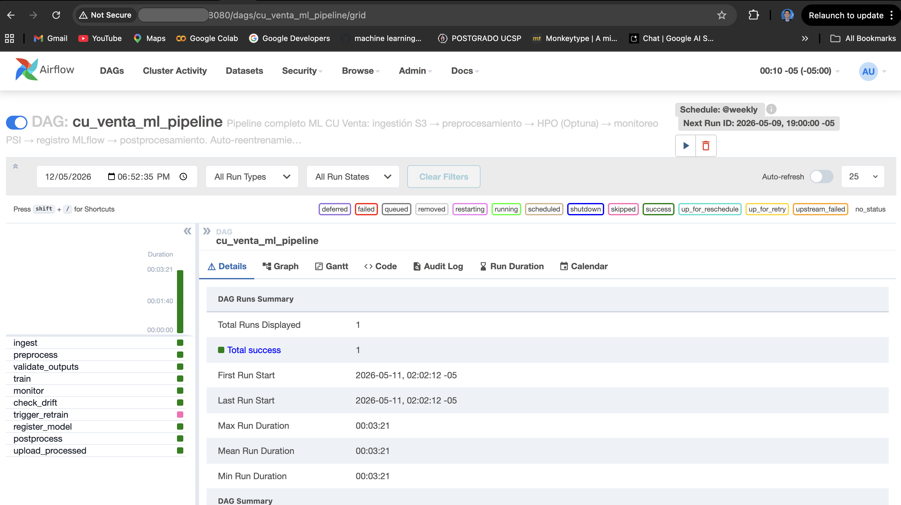
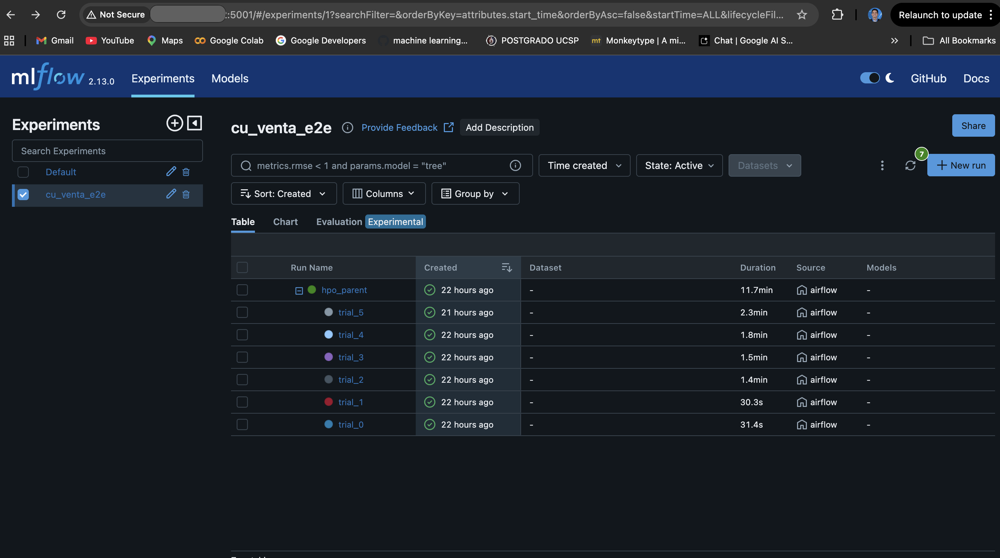
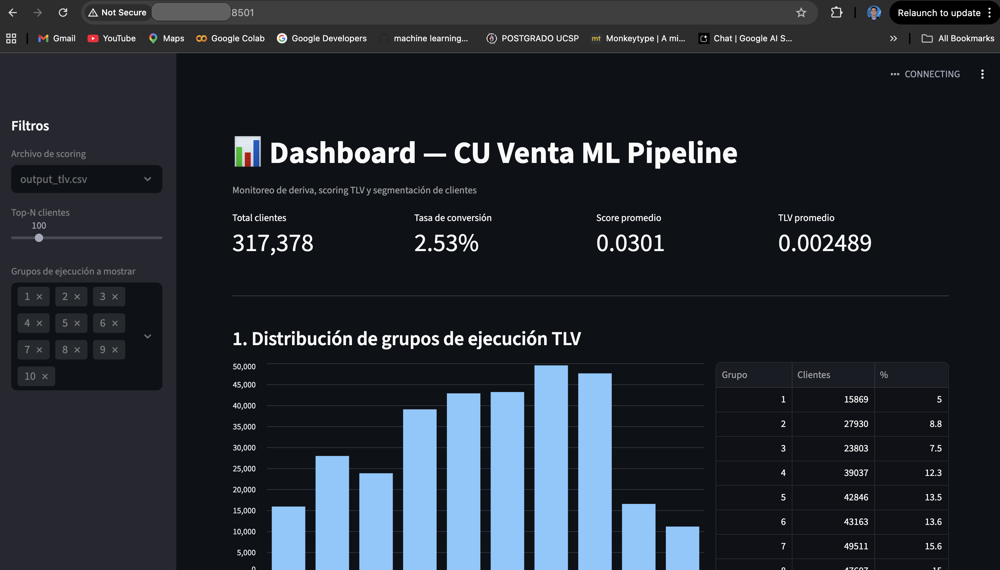

# Pipeline ML E2E — CU Venta

## Autores: Franco Alfredo Lazo Acuña, Herman Paul Moreno Alvarado

Pipeline de Machine Learning end-to-end para el modelo de propensión de venta cruzada (CU Venta), con orquestación en **Apache Airflow**, tracking y **Model Registry en MLflow**, y HPO con **Optuna**.

## Resumen

Este proyecto implementa un pipeline completo que incluye:
- ingestión de datos desde S3 o fuente local,
- preprocesamiento y split temporal,
- entrenamiento con XGBoost y optimización de hiperparámetros con Optuna,
- monitoreo de drift con PSI/AUC,
- re-entrenamiento automático en caso de drift,
- registro y gestión de versiones de modelos en MLflow,
- postprocesamiento de scoring TLV y exportación de resultados.


## Estructura del proyecto

```
proyecto_ml_final/
├── dags/
│   └── ml_pipeline_dag.py       ← DAG de Airflow (pipeline completo + auto-reentrenamiento)
├── src/
│   ├── __init__.py
│   ├── ingestion.py             ← Descarga desde S3 con versionado
│   ├── preprocessing.py         ← Limpieza, imputación, encoding, splits
│   ├── training.py              ← XGBoost + HPO (Optuna) + MLflow
│   ├── monitoring.py            ← PSI, AUC, Recall por decil
│   ├── postprocessing.py        ← Scoring TLV, grupos de ejecución, réplica
│   └── reporting.py             ← Gráficos mes a mes por grupo
├── data/
│   ├── raw/                     ← CSVs de entrada (p1_extrac.csv … p10_extrac.csv)
│   ├── processed/               ← df_train.csv, df_test.csv, df_val.csv
│   ├── postprocessed/           ← output_tlv.csv
│   ├── monitoring/              ← metrics_by_month.csv, PSI reports
│   └── replica/                 ← Archivos pipe-delimitados (réplica)
├── config/
│   └── config.yaml              ← Configuración central del pipeline
├── instructions/                ← Documentación del curso (no se sube a Docker)
├── main.py                      ← Orquestador local (sin Airflow)
├── dashboard.py                 ← Dashboard interactivo Streamlit
├── Dockerfile                   ← Imagen custom: pipeline ML + dashboard Streamlit
├── Dockerfile.airflow           ← Imagen custom de Airflow con dependencias pre-instaladas
├── docker-compose.yml           ← Stack: Airflow + MLflow + PostgreSQL + Streamlit
├── .dockerignore
├── .env.example                 ← Plantilla de credenciales (copia a .env)
├── pyproject.toml               ← Dependencias y metadata del proyecto
├── .gitignore
└── README.md
```

## Arquitectura del pipeline

```
Ingestión S3 → Preprocesamiento → Validación → Entrenamiento HPO (Optuna)
                                                         ↓
                                               Monitoreo PSI/AUC
                                                         ↓
                                              ┌─ PSI > 0.25 → Re-entrenamiento automático
                                              ↓
           PSI OK → Model Registry (Staging) → Postprocesamiento → Upload S3
```

## Etapas del pipeline

| Etapa | Módulo | Descripción |
|---|---|---|
| 1. Ingestión | `src/ingestion.py` | Descarga CSV desde S3 con versionado; registra VersionId para trazabilidad |
| 2. Preprocesamiento | `src/preprocessing.py` | Elimina columnas >80% NaN, imputa, codifica categóricas, split temporal train/test/val |
| 3. Validación | DAG | Verifica filas mínimas y columnas requeridas en cada split |
| 4. Entrenamiento | `src/training.py` | HPO con Optuna (configurable, default 6 trials en Docker), registra parámetros/métricas/modelo en MLflow |
| 5. Monitoreo | `src/monitoring.py` | PSI variables crudas, procesadas y deciles de score; AUC y Recall por decil; genera `metrics_by_month.csv` |
| 6. Deriva | DAG | Si PSI score > 0.25, dispara re-entrenamiento automático vía TriggerDagRunOperator |
| 7. Model Registry | MLflow | Promueve modelo a `Staging` en el MLflow Model Registry |
| 8. Postprocesamiento | `src/postprocessing.py` | TLV scoring, segmentación en 10 grupos, réplica pipe-delimitada |
| 9. Upload S3 | DAG | Sube `processed/`, `monitoring/`, `postprocessed/` y `replica/` al bucket S3 principal |

## Instalación

### Opción A — Ejecución local (sin Docker)

```bash
# 1. Crear entorno virtual
python -m venv .venv && source .venv/bin/activate

# 2. Instalar dependencias
pip install -e ".[dev]"

# 3. Levantar MLflow local
mlflow server \
  --host 0.0.0.0 \
  --port 5001 \
  --backend-store-uri sqlite:///mlruns.db \
  --default-artifact-root ./mlartifacts

# 4. Ejecutar pipeline de entrenamiento (modo estándar)
python main.py --mode train

# 5. Ejecutar con HPO (Optuna, 30 trials)
python main.py --mode train --hpo --n-trials 30

# 6. Inferencia sobre un periodo
python main.py --mode inference --period 10

# 7. Dashboard interactivo
streamlit run dashboard.py
```

### Opción B — Docker Compose (stack completo: Airflow + MLflow + PostgreSQL)

> **Prerequisito:** tener Docker Desktop instalado.

**1. Crea tu archivo de configuración:**

```bash
cp .env.example .env
```

**2. Construye la imagen personalizada de Airflow** (solo la primera vez o al cambiar dependencias):

```bash
docker build -f Dockerfile.airflow -t airflow-custom:latest .
```

> Esto pre-instala `xgboost`, `optuna`, `mlflow`, `scikit-learn`, `boto3` y `s3fs` en la imagen
> de Airflow, evitando que cada contenedor ejecute `pip install` al arrancar (lo que causaba
> picos de CPU/RAM y fallos por falta de recursos).

**3. Elige la fuente de datos:**

#### B.1 — Datos locales (sin AWS, más rápido para pruebas)

Pon en `.env`:
```
DATA_SOURCE=local
```

Coloca los CSVs en `./data/raw/` (ya los tienes ahí si usaste la Opción A antes):
```
data/raw/
├── p1_extrac.csv
├── p2_extrac.csv
├── ...
└── p10_extrac.csv
```

Los contenedores Airflow montan esa carpeta automáticamente en `/opt/airflow/data/raw/`. No necesitas credenciales AWS.

#### B.2 — Datos desde AWS S3 (producción)

Pon en `.env`:
```
DATA_SOURCE=s3
AWS_ACCESS_KEY_ID=tu_access_key
AWS_SECRET_ACCESS_KEY=tu_secret_key
AWS_DEFAULT_REGION=us-east-1
S3_BUCKET_RAW=tu-bucket          # bucket donde están p1_extrac.csv … p10_extrac.csv
S3_PREFIX_RAW=raw/               # carpeta dentro del bucket
MLFLOW_ARTIFACTS_BUCKET=tu-bucket-mlflow  # bucket para guardar modelos
```

El pipeline descargará los CSV automáticamente desde S3 al arrancar el DAG.

> Puedes cambiar entre modos sin reiniciar los contenedores desde la UI de Airflow:
> `Admin → Variables → DATA_SOURCE` → `local` o `s3`.

> **Nota:** `dashboard.py` está montado como volumen en el contenedor Streamlit. Cualquier cambio al archivo se recarga automáticamente sin necesidad de rebuild.

**4. Levanta todos los servicios:**

```bash
docker compose up -d

# Verificar que todos estén healthy (puede tardar ~2 min la primera vez)
docker compose ps
```

**5. URLs disponibles:**

| Servicio | URL | Credenciales |
|---|---|---|
| Airflow UI | http://localhost:8080 | admin / admin |
| MLflow UI | http://localhost:5001 | — |
| Streamlit | http://localhost:8501 | — |

**6. Activa y ejecuta el DAG en Airflow:**

- Entra a http://localhost:8080
- Busca el DAG `ml_pipeline_dag`
- Actívalo con el toggle y haz clic en **Trigger DAG**
- El pipeline ejecuta: Ingestión → Preprocesamiento → Entrenamiento HPO → Monitoreo PSI → Postprocesamiento TLV

**7. Detener el stack:**

```bash
docker compose down          # detiene contenedores (conserva datos)
docker compose down -v       # detiene y borra volúmenes (reset completo)
```

### Configuración de Variables en Airflow (opcional, ya se auto-configuran)

Las variables se establecen automáticamente al iniciar. Para cambiarlas desde terminal:

```bash
docker compose exec airflow-web airflow variables set DATA_SOURCE local
docker compose exec airflow-web airflow variables set S3_BUCKET_RAW tu-bucket
docker compose exec airflow-web airflow variables set PSI_ALERT_THRESHOLD 0.25
```

## Estructura del bucket S3 (solo para DATA_SOURCE=s3)

```
s3://ml-project-ucsp-s3/
├── raw/                  ← datos de entrada (p1_extrac.csv … p10_extrac.csv)
├── processed/            ← df_train.csv, df_test.csv, df_val.csv  [generado por pipeline]
├── monitoring/           ← psi_*.csv, metrics_by_month.csv        [generado por pipeline]
├── postprocessed/        ← output_tlv.csv                         [generado por pipeline]
└── replica/              ← EC_OMNICANAL_*.txt                     [generado por pipeline]
```

Las carpetas `processed/`, `monitoring/`, `postprocessed/` y `replica/` se crean y actualizan automáticamente al finalizar cada ejecución del DAG (tarea `upload_processed`).
Los mismos datos están disponibles localmente en `data/` para la Opción A.

## MLflow Model Registry — Flujo de versiones

```
Training → None (nuevo)
              ↓ (check_drift: PSI OK)
           Staging
              ↓ (validación manual o automatizada)
           Production
```

Para promover manualmente a producción:

```python
import mlflow
from mlflow.tracking import MlflowClient

client = MlflowClient("http://localhost:5000")
client.transition_model_version_stage(
    name="cu_venta_xgb",
    version=1,
    stage="Production",
    archive_existing_versions=True,
)
```

## Monitoreo y auto-reentrenamiento

El módulo `src/monitoring.py` calcula tres tipos de PSI:

- **PSI variables crudas** (raw): detecta cambios en las distribuciones de entrada.
- **PSI variables procesadas**: detecta cambios post-preprocesamiento.
- **PSI deciles del score**: compara la distribución del score de train vs val.

| PSI | Estado | Acción |
|---|---|---|
| < 0.10 | OK | Sin acción |
| 0.10 – 0.25 | WARN | Revisar manualmente |
| > 0.25 | ALERT | Re-entrenamiento automático (configurable via Variable `PSI_ALERT_THRESHOLD`) |

## Scoring TLV y grupos de ejecución

La puntuación compuesta TLV se calcula en `src/postprocessing.py` con la fórmula exacta definida por el negocio:

```
puntuacion_tlv = prob × prob_value_contact × log(monto + 1) × prob_frescura
```

La población se segmenta en 10 grupos usando los cuantiles fijos `DIST_GE` (NO modificar sin alineación con el equipo de negocio).

## Comandos útiles

```bash
# Ver logs de entrenamiento
tail -f /tmp/mlflow_run.log

# Limpiar datos procesados y re-ejecutar
rm -rf data/processed/* data/postprocessed/* data/monitoring/* && python main.py --mode train

# Ejecutar solo preprocesamiento
python main.py --mode preprocess

# Ejecutar con datos de S3
python main.py --mode train --use-s3 --hpo

# Ver modelos registrados en MLflow
mlflow models list --tracking-uri http://localhost:5000
```

## Servicios levantados

### Airflow



### MlFlow



### Streamlit



## Link del repositorio

https://github.com/HermanMoreno98/proyecto_ml_final